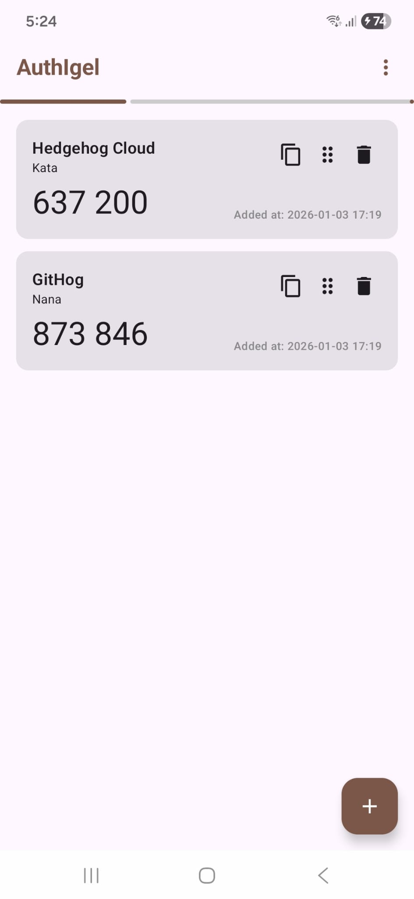

## IgelAuth

## Features
- No internet connection is needed.
- Import records from/Export records to plain text file.
- Import records by scanning QR-Code.
- Add records by manual input.
- Encrypted backup with user defined password (auto-backup possible).
- Drag and drop to order the records.
- Biometric lock for the app.
- TODO: disable screenshot in the app.
- ...

## Technical Stack
- Language: Kotlin
- UI: Jetpack Compose
- Datastore: Protobuf
- Cryptography: Tink